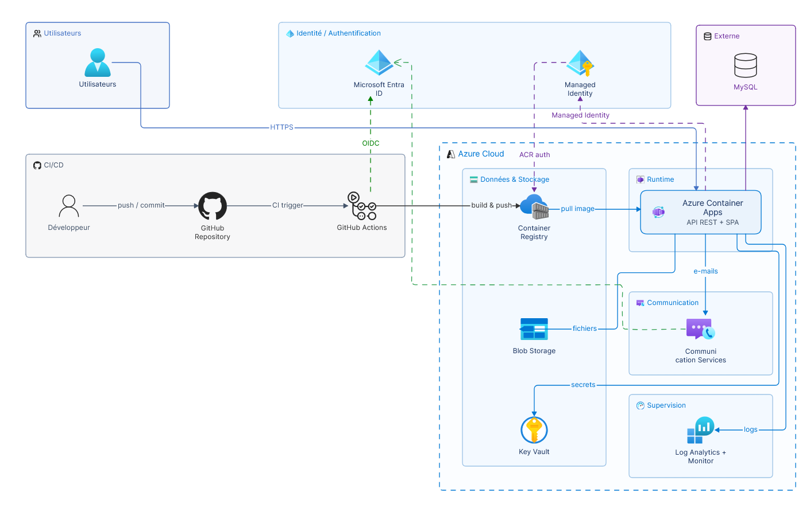

# Documania — Guide d'installation

Plateforme de gestion documentaire : **Angular 22** (frontend) + **Spring Boot 4** (backend) + **MySQL**.



---

## Prérequis

| Outil | Version requise | Vérification |
|-------|----------------|--------------|
| Java | 21+ | `java -version` |
| Maven | 3.9+ (ou utiliser `mvnw`) | `mvn -v` |
| Node.js | 20+ | `node -v` |
| npm | 10+ | `npm -v` |
| MySQL | 8+ | `mysql --version` |

---

## 1. Cloner le projet

```bash
git clone https://github.com/anka-cy/documania.git
cd documania
```

---

## 2. Base de données

Vous pouvez utiliser **n'importe quel serveur MySQL 8+** (local, Docker, cloud).

### Option A : MySQL local

```sql
CREATE DATABASE `documania-db` CHARACTER SET utf8mb4 COLLATE utf8mb4_unicode_ci;
```

### Option B : Aiven Cloud MySQL (recommandé pour le déploiement)

1. Créer un compte gratuit sur [console.aiven.io](https://console.aiven.io)
2. Créer un service **MySQL** (forfait `hobbyist` ou `startup`)
3. Une fois le service actif, récupérer les informations de connexion dans **Overview → Connection information** :
   - Host / Port
   - Username
   - Password
4. Créer la base de données via le panneau de contrôle ou en CLI :
   ```sql
   CREATE DATABASE `documania-db`;
   ```
5. Mettre à jour `backend/.env` avec les informations Aiven :
   ```env
   DB_URL=jdbc:mysql://<host>:<port>/documania-db?sslMode=REQUIRED
   DB_USERNAME=<username>
   DB_PASSWORD=<password>
   ```

Les migrations **Flyway** s'exécutent automatiquement au démarrage du backend (27 migrations).

### Déploiement Azure (optionnel)

Si vous voulez déployer sur Azure, un template Bicep est disponible :

```bash
az login
az group create --name documania-rg --location westeurope
az deployment group create \
  --resource-group documania-rg \
  --template-file azure-infra.bicep \
  --parameters environment=dev
```

Cela crée : Container Apps, Blob Storage, Container Registry, Log Analytics.

> **Note** : MySQL est hébergé sur Aiven (voir section 2). Le Bicep ne provisionne que les ressources Azure.

### CI/CD GitHub Actions

Le pipeline automatise : tests → build → push image Docker → déploiement Container Apps.

Configurer les **GitHub Secrets** (`Settings → Secrets and variables → Actions`) :

| Secret | Description | Où la trouver |
|--------|-------------|---------------|
| `ACR_NAME` | Nom du Container Registry | `az acr list -o table` |
| `ACR_USERNAME` | Login ACR (service principal ou admin) | `az acr credential show` |
| `ACR_PASSWORD` | Mot de passe ACR | `az acr credential show` |
| `AZURE_CLIENT_ID` | Client ID du service principal | `az ad sp list --query "[].appId"` |
| `AZURE_TENANT_ID` | Tenant ID Azure | `az account show --query tenantId` |
| `AZURE_SUBSCRIPTION_ID` | Subscription ID | `az account show --query id` |
| `AZURE_RESOURCE_GROUP` | Nom du groupe de ressources | `az group list -o table` |
| `CONTAINER_APP_NAME` | Nom de l'app Container Apps | `az containerapp list -o table` |

Créer le service principal pour le déploiement :

```bash
az ad sp create-for-rbac \
  --name "documania-cicd" \
  --role "Contributor" \
  --scopes "/subscriptions/<.subscription-id>" \
  --sdk-auth
```

Le pipeline se déclenche automatiquement sur chaque push à `master`.

---

## 3. Backend (Spring Boot)

### 3.1 Configurer les variables d'environnement

Copier le fichier d'exemple :

```bash
cd backend
cp .env.example .env
```

Puis éditer `backend/.env` avec vos propres valeurs :

| Variable | Description | Exemple |
|----------|-------------|---------|
| `DB_URL` | URL JDBC vers MySQL | `jdbc:mysql://localhost:3306/documania-db?sslMode=DISABLED` |
| `DB_USERNAME` | Utilisateur MySQL | `root` |
| `DB_PASSWORD` | Mot de passe MySQL | `votre_mdp` |
| `API_ADMIN_EMAIL` | Email du compte admin | `admin@votre-domaine.com` |
| `API_ADMIN_PASSWORD` | Mot de passe admin | `un_mot_de_passe_solide` |
| `MAIL_HOST` | Serveur SMTP | `smtp.gmail.com`, `smtp-mail.outlook.com`... |
| `MAIL_PORT` | Port SMTP | `587` |
| `MAIL_USERNAME` | Identifiant SMTP | `votre-email@gmail.com` |
| `MAIL_PASSWORD` | Mot de passe SMTP | `votre_mdp_app` |
| `MAIL_FROM` | Adresse d'expédition | `noreply@votre-domaine.com` |
| `APP_FRONTEND_BASE_URL` | URL frontend (pour les emails) | `http://localhost:8080` |
| `JWT_SECRET` | Secret JWT (≥32 car.) | Générer avec : `openssl rand -base64 64` |

> **SMTP** : Pour les tests, Gmail fonctionne avec des [mots de passe d'application](https://myaccount.google.com/apppasswords). Outlook/Yahoo sont aussi compatibles. Sans SMTP, l'application fonctionne mais les emails (activation, reset mot de passe) ne partiront pas.

> **Important** : Ne jamais commiter le fichier `.env`. Il est déjà dans `.gitignore`.

### 3.2 Lancer le backend

```bash
cd backend

# Avec Maven wrapper (recommandé) :
./mvnw spring-boot:run

# Ou avec Maven installé :
mvn spring-boot:run
```

Le serveur démarre sur **http://localhost:8080**.

### 3.3 Compte admin

Le compte admin est créé automatiquement au premier démarrage avec les credentials définis dans `API_ADMIN_EMAIL` et `API_ADMIN_PASSWORD`.

---

## 4. Frontend (Angular)

### 4.1 Installer les dépendances

```bash
cd frontend
npm install
```

### 4.2 Lancer le frontend

```bash
ng serve
```

Le frontend démarre sur **http://localhost:4200**.

Le fichier `proxy.conf.json` redirige automatiquement les appels `/api/*` vers le backend sur le port 8080.

---

## 5. Tests

### Backend (388 tests)

```bash
cd backend
./mvnw test
```

### Frontend

```bash
cd frontend
ng test
```

---

## 6. Architecture du projet

```
documania-final/
├── backend/                          # Spring Boot 4
│   ├── src/main/java/.../
│   │   ├── account/                  # Inscription, activation, reset mot de passe
│   │   ├── audit/                    # Journal d'audit
│   │   ├── auth/                     # Login, JWT, refresh tokens
│   │   ├── catalog/                  # Catalogue de services
│   │   ├── client/                   # Gestion des clients
│   │   ├── dashboard/                # Résumé dashboard
│   │   ├── email/                    # Envoi d'emails (outbox pattern)
│   │   ├── export/                   # Export CSV
│   │   ├── notification/             # Notifications + SSE temps réel
│   │   ├── offer/                    # Offres commerciales
│   │   ├── order/                    # Commandes clients
│   │   ├── role/                     # RBAC (ADMIN, STAFF, CLIENT)
│   │   ├── security/                 # JWT filter, rate limiting
│   │   ├── subscription/             # Abonnements
│   │   ├── ticket/                   # Support tickets + pièces jointes
│   │   └── user/                     # Gestion des comptes staff
│   ├── src/main/resources/
│   │   ├── application.properties
│   │   └── db/migration/             # 27 migrations Flyway (V1→V27)
│   ├── src/test/                     # 388 tests unitaires + intégration
│   ├── .env.example                  # Template de configuration
│   └── .env                          # Secrets (à créer, ignoré par Git)
│
├── frontend/                         # Angular 22 (standalone)
│   └── src/app/
│       ├── core/                     # Auth, API, interceptors, guards, SSE
│       ├── features/
│       │   ├── authentication/       # Login, register, activation, password reset
│       │   ├── staff/                # Portal staff (dashboard, clients, tickets, etc.)
│       │   └── client/               # Portal client (dashboard, commandes, tickets, etc.)
│       ├── layout/                   # Layouts (staff, client, public)
│       └── shared/                   # Composants réutilisables, pipes, validators
│
├── azure-infra.bicep                 # Template Azure (optionnel)
├── docs/archi-azure.png              # Diagramme d'architecture
└── .gitignore
```

---

## 7. Démarrage rapide

```bash
# Terminal 1 — Backend
cd backend
cp .env.example .env   # puis éditer avec vos credentials
./mvnw spring-boot:run

# Terminal 2 — Frontend
cd frontend
npm install
ng serve
```

Ouvrir **http://localhost:4200** dans le navigateur.

---

## 8. Fonctionnalités

- Authentification JWT avec refresh tokens
- RBAC : 3 rôles (ADMIN, STAFF, CLIENT) avec guards Angular
- Gestion des clients, commandes, abonnements, services
- Système de tickets de support avec pièces jointes
- Notifications temps réel (SSE) + polling 30s en fallback
- Journal d'audit avec rétention configurable
- Export CSV
- Emails transactionnels (SMTP configurable)
- UI responsive, thème Bootstrap personnalisé
